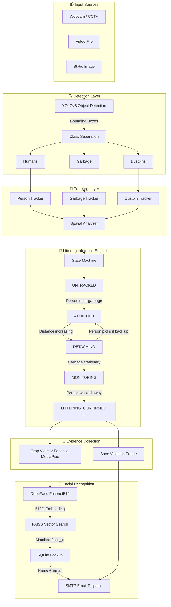
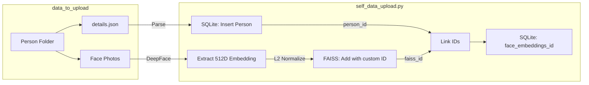
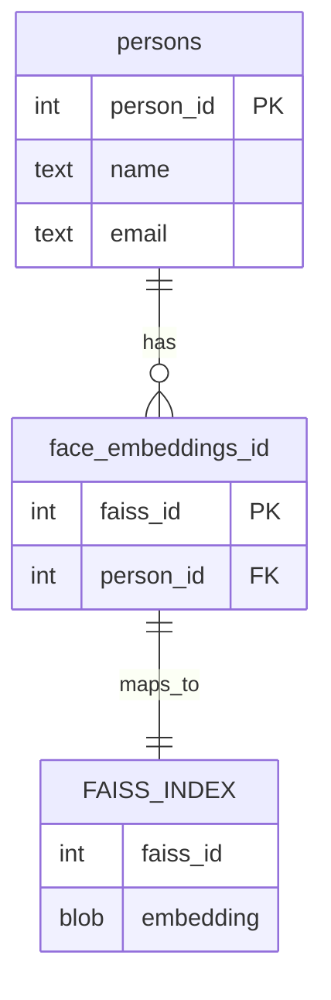
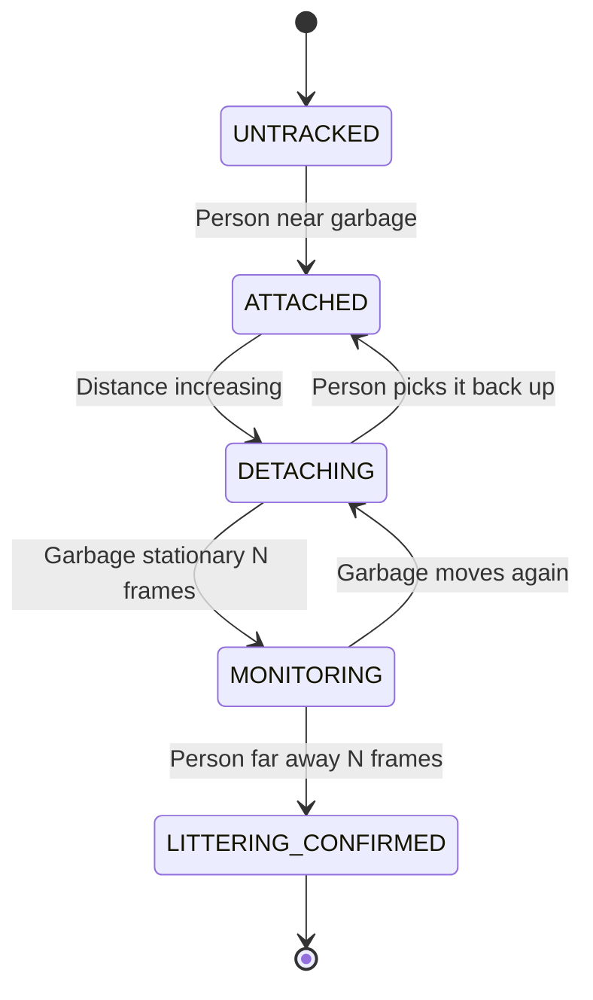

# 🇮🇳 Project Drishti — SwachhBharat

[](https://www.python.org/)
[](https://opensource.org/licenses/MIT)
[](#)

> AI-Powered Littering Detection, Violator Identification & Automated Penalty System

**[🎥 See the Live Demo Here!](https://drive.google.com/file/d/1DsdMDOpNsNDCIIkZ-i0hOZVK5RwnV_Nu/view)**

## 📖 Project Overview

Project Drishti is an end-to-end AI surveillance pipeline that detects littering in real-time using computer vision, identifies the violator through facial recognition, and automatically dispatches an e-challan (fine notice) via email — all without human intervention.

---

## 🏗️ System Architecture

### End-to-End Pipeline



### Data Ingestion Pipeline



### Database Schema



### State Machine Transitions



---

## ✨ Key Features

| Feature | Description |
|---|---|
| **Real-Time Detection** | YOLOv8 detects Humans, Garbage, and Dustbins simultaneously |
| **Temporal State Machine** | Tracks person-garbage relationship over time to infer littering behavior |
| **State Inheritance** | Handles YOLO detection gaps during drops by transferring state to new IDs |
| **Dustbin-Aware** | Ignores garbage disposed near dustbins (legitimate disposal) |
| **Face Cropping** | MediaPipe isolates the violator's face from the person bounding box |
| **Facial Recognition** | DeepFace (Facenet512) + FAISS for high-speed identity matching |
| **Automated E-Challan** | SMTP email with violation image and Rs. 500 fine notice |
| **Bulk Data Ingestion** | Admin script to register identities from folders of images + JSON |

---

## 💻 Tech Stack

| Layer | Technology |
|---|---|
| Object Detection | YOLOv8 (Ultralytics) |
| Object Tracking | Custom Centroid Tracker (SciPy) |
| Face Detection | MediaPipe |
| Face Recognition | DeepFace (Facenet512 + MTCNN) |
| Vector Database | FAISS (IndexFlatIP + IndexIDMap) |
| Relational Database | SQLite |
| Email System | Python smtplib (Gmail SMTP) |
| Configuration | python-dotenv |

---

## 📂 Project Structure

```
ProjectDrishti_SwachhBharat/
├── README.md
└── backend/
    ├── config.py                  # Centralized thresholds & settings
    ├── detector.py                # YOLO inference wrapper
    ├── tracker.py                 # Centroid-based object tracker
    ├── spatial_analyzer.py        # Distance & proximity calculations
    ├── littering_detector.py      # State machine engine
    ├── pipeline.py                # Orchestrator (Detection → Tracking → Inference → Recognition → Email)
    ├── main_webcam.py             # Entry point: Live webcam
    ├── main_video.py              # Entry point: Video file
    ├── main_photo.py              # Entry point: Static image
    ├── self_data_upload.py        # Bulk identity registration script
    ├── best.pt                    # Trained YOLO model weights
    ├── requirements.txt           # Python dependencies
    ├── .env                       # SMTP credentials (not committed)
    ├── utils/
    │   ├── sqlite_db.py           # SQLite operations
    │   ├── faiss_db.py            # FAISS operations
    │   ├── deepface_recognition.py # Embedding extraction & matching
    │   └── emailer.py             # SMTP email dispatch
    ├── CONTEXT/                   # Architecture documentation
    ├── violation/                 # Saved violation evidence (auto-generated)
    └── garbage_detected/          # Cropped garbage images (auto-generated)
```

---

## 🚀 Quick Start

### 1. Install Dependencies
```bash
cd backend
pip install -r requirements.txt
```

### 2. Configure Email Credentials
Create a `.env` file in `backend/`:
```env
SMTP_EMAIL=your_email@gmail.com
SMTP_APP_PASSWORD=your_gmail_app_password
```

### 3. Register Identities
Place person folders inside `backend/data_to_upload/`:
```
data_to_upload/
    Aryan Varshney/
        details.json    → {"name": "Aryan Varshney", "email": "arv.coder@gmail.com"}
        photo1.jpg
```
Then run:
```bash
python self_data_upload.py
```

### 4. Run the System
```bash
# Live webcam
python main_webcam.py

# Video file
python main_video.py --source videos/test.mp4
```

---

## 🇮🇳 Contributing to a Cleaner India

This project supports the **Swachh Bharat (Clean India)** initiative by leveraging AI to enforce cleanliness standards and deter public littering through automated monitoring and penalties. We welcome contributions to make our surroundings cleaner and greener!